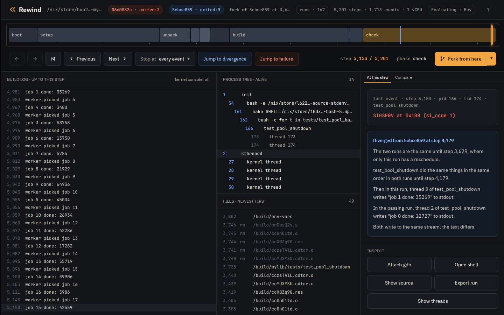
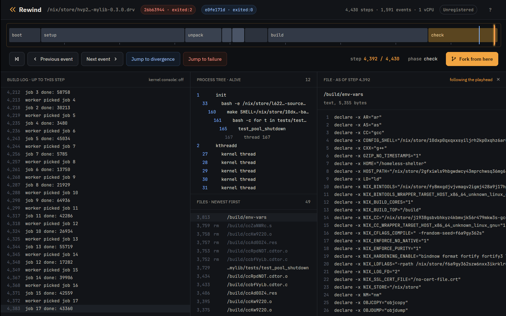
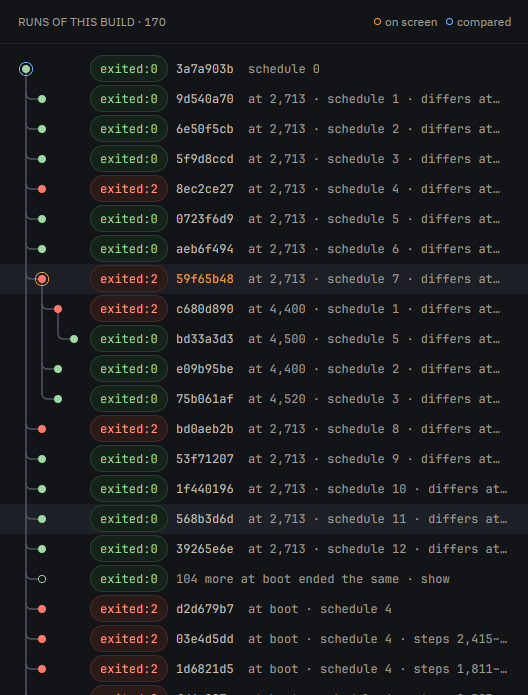
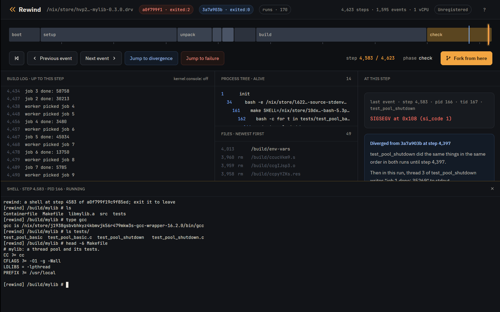

<p align="center">
  
</p>

<h1 align="center">Rewind VM</h1>

<p align="center">
  <b>Deterministic Linux VMs you can scrub, rewind and fork.</b><br />
  Catch a flaky build or test once, then replay it exactly, step through it, and branch it.
</p>

<p align="center">
  <a href="https://rewindvm.dev">Website</a> ·
  <a href="docs/tutorial-nix.md">Nix tutorial</a> ·
  <a href="docs/tutorial-container.md">Container tutorial</a> ·
  <a href="docs/design.md">Design</a> ·
  <a href="https://github.com/fzakaria/rewindvm/releases">Releases</a>
</p>

<p align="center">
  <a href="https://github.com/fzakaria/rewindvm/actions/workflows/ci.yml"></a>
</p>

<p align="center">
  
</p>

Rewind VM runs a Nix build, a test suite or any Linux command inside a KVM
virtual machine whose every run is a function of its inputs. The same inputs
give the same run, at the same steps, every time. A failure you saw once is a
failure you keep: replay it, scrub through it step by step, read any file as it
was at any step, and fork it with a different thread interleaving from any
point.

```console
$ rewind check github:fzakaria/rewindvm#mylib
schedule   0: exited:0             6162 steps  aa30ea54dc47  run 3a7a903ba51d85aa
schedule   1: exited:0             7115 steps  aa30ea54dc47  run deaf00808dc50162
schedule   2: exited:0             7339 steps  aa30ea54dc47  run 0a7c28a6d574df14
schedule   3: exited:0             7277 steps  aa30ea54dc47  run bbc132f6e733e2c1
schedule   4: exited:2             5436 steps    run d2d679b756ff023c
...

schedule 4 ends differently; narrowing the steps it perturbs
perturbing only steps 2713..4571 still ends differently

passing: run 3a7a903ba51d85aa
failing: run a0f799f19c9f85ed

where ./tests/test_pool_shutdown first behaves differently:
  ...
  left        4151   166/167   write(1, "worker picked job 2\n")
  left        4162   166/168   write(1, "worker picked job 3\n")
  right       4398   166/168   write(1, "worker picked job 2\n")
  right       4422   166/167   write(1, "worker picked job 3\n")

$ rewind events a0f799f1 | grep SIGSEGV
      4583   166/167   SIGSEGV code=1 addr=0x108
...

$ rewind replay a0f799f1
identical: 1595 events over 4623 steps
```

## Install

On x86_64 Linux with KVM:

```console
$ curl -fsSL https://rewindvm.dev/install | sh
```

With Nix, run it straight from the flake, or install it into your profile:

```console
$ nix run github:fzakaria/rewindvm -- pmu status
$ nix run github:fzakaria/rewindvm#app
$ nix profile install github:fzakaria/rewindvm github:fzakaria/rewindvm#app
```

On NixOS, add the flake as an input and turn on its module:

```nix
inputs.rewind.url = "github:fzakaria/rewindvm";

# in your configuration, with inputs.rewind.nixosModules.default imported;
# it also adds rewindvm.cachix.org to Nix's substituters
programs.rewind.enable = true;
programs.rewind.app.enable = true;
# AMD only: make the branch counter exact at every boot
programs.rewind.amdBranchCounterWorkaround = true;
```

Or take the tarballs from the
[latest release](https://github.com/fzakaria/rewindvm/releases/latest)
yourself:

```console
# the rewind command, with the VM's kernel
$ curl -L https://github.com/fzakaria/rewindvm/releases/latest/download/rewind-x86_64-linux.tar.gz | tar xz
# the desktop app
$ curl -L https://github.com/fzakaria/rewindvm/releases/latest/download/rewind-app-x86_64-linux.tar.gz | tar xz
# the kernel's debug symbols for rewind gdb, next to the command (150 MB)
$ curl -L https://github.com/fzakaria/rewindvm/releases/latest/download/rewind-debug-x86_64-linux.tar.gz | tar xz
```

`/dev/kvm` must be readable and writable by you. On AMD Ryzen and EPYC, run
`sudo rewind pmu enable` once after each boot so the VM's clock can follow the
work done inside it; [Time inside the VM](docs/pmu.md) explains why.

## Use it

```console
# build a derivation in the VM; the output is checked against the host's
$ rewind nix nixpkgs#hello

# run the derivation under many thread schedules and show where a failure parts ways
$ rewind check github:fzakaria/rewindvm#mylib

# any command in a root filesystem: a directory, an erofs image, or a docker export
$ rewind run --root mylib.tar --cwd /src -- make check

# list runs and look inside one
$ rewind ls
$ rewind log <run> --steps
$ rewind ps <run> <step>
$ rewind cat <run> <step> /build/env-vars

# a shell inside the VM at a step, in a throwaway fork; --with brings more
# Nix packages into it
$ rewind shell <run> <step> --pid <pid>
$ rewind shell <run> <step> --pid <pid> --with nixpkgs#strace

# gdb on a fork at a step, with the symbols and sources of the kernel and of
# the process running there; arguments after -- go to gdb
$ rewind gdb <run> <step>
$ rewind gdb <run> <step> -- -batch -ex 'break pool.c:77' -ex continue -ex bt

# every thread of a process, even with the CPU idle, as at a deadlock
$ rewind gdb <run> <step> --pid <pid> -- -batch -ex 'thread apply all bt'

# the line of the program's own code a thread was on, with its callers: by
# default the thread of the step's event; --json for programs
$ rewind where <run> <step>
$ rewind where <run> <step> --tid <tid> --json

# branch a run at a step under another schedule, or replay it exactly
$ rewind fork <run> <step> --schedule 2
$ rewind replay <run>

# remove a run's forks that ran exactly as an older one did
$ rewind prune <run> --identical --dry-run
$ rewind prune <run> --identical

# remove a run and every fork of it, and forks of those
$ rewind remove <run> --dry-run
$ rewind remove <run>

# remove many runs in one call, here every fork, keeping the runs forked from
$ rewind ls | awk '/fork of/ {print $1}' | xargs rewind remove

# remove the cached images and stored pages no run uses any more
$ rewind gc --dry-run
$ rewind gc

# share a run as one file
$ rewind export <run> --replayable
$ rewind import <file>.rwd
$ rewind import https://github.com/fzakaria/rewindvm/releases/download/case-studies/nix-gc-closure-sigpipe-replayable.rwd
```

## The desktop app

The app scrubs a recorded run: drag the playhead over the timeline of phases,
and the build log, the process tree and the files follow it. It jumps to the
failure, or to the first point where the run parts from a passing one and says
in words what each did next. Click a file to read it as it was at the
playhead, its syntax colored for C, C++, Rust, Go, Python, shell (Nix's
env-vars among it), Makefiles, Markdown, Nix, assembly and Dockerfiles, and
a binary file as a hex dump colored by byte. Long lines do not wrap: Shift
with the wheel, or a sideways swipe, scrolls them while the line numbers stay
put. Fork from here branches the run under a new schedule.

<p align="center">
  
</p>

Open shell starts a shell inside the VM at the playhead, in the build's
directory with its environment, and Attach gdb opens gdb on the same fork,
both in a terminal pane below the scrubber. Show source, or the s key, opens
a panel with the whole source file of the program's own code the playhead's
thread was in, scrolled to the line it was on, and the frames that led there
in a short list below; clicking a frame shows its file at its line. The
file's syntax is colored, and its long lines scroll sideways, as in the file
viewer.

Every run of a build is one family: the run under schedule 0, with its
threads left alone, the schedules `rewind check` tried, and every fork. The
start screen lists one line per family however many runs it has, and the runs
pill in the header opens the Runs panel, which draws the family as a tree the
way ISL and Jujutsu draw a history. Each fork branches off the run it came
from, red for failed and green for passed, with the step it forked at, its
schedule and where it first differs. The schedules `rewind check` ran from
boot hang off the schedule 0 run, and those that ended the way it did fold into
one row that opens on a click. The runs `check` makes narrowing a schedule to a
window of steps hang off that schedule and fold the same way, but for the
narrowest window that still ends as it did. A family recorded on two machines,
or with different `--cores`, has a schedule 0 run for each. Click a run to open it
beside the run it hangs under; right-click it to compare it with the run on
screen, copy its id, or remove it with its forks.

<p align="center">
  
</p>

<p align="center">
  
</p>

```console
$ nix run github:fzakaria/rewindvm#app -- ~/.local/share/rewind/runs/<run>
```

It opens `.rwd` exports too, from a file or an https URL. A replayable export
goes into Rewind's runs in the background while it is on screen, so the shell,
gdb and forks work on it. The start screen lists the runs recorded most
recently, and the app comes with an example run and a short tour.
See [pricing](https://rewindvm.dev/#pricing) for licenses.

## Case studies

- [A SIGPIPE in Nix's gc-closure test](docs/case-studies/nix-gc-closure-sigpipe.md):
  Rewind's first run of Nix's functional tests failed in `gc-closure.sh`, a
  flake nobody had reported. A two-line `printf` piped into `head -n1` under
  `pipefail` is two writes, and when `head` exits between them the writer
  dies of SIGPIPE. Rewind narrows the failure to the two steps between those
  writes; on the host the test never failed in 200 runs.
- [A hang in Nix's store schema migration](docs/case-studies/nix-schema-migration-hang.md):
  a known, fixed bug, [NixOS/nix#15693](https://github.com/NixOS/nix/issues/15693),
  reproduced on the version it was reported against. `rewind shell` and gdb
  inside the VM pin it to `SQLITE_BUSY_SNAPSHOT` retried inside an open
  transaction, which explains why the first fix did not stop it and the
  second did.
- [Lost task output in devenv](docs/case-studies/devenv-task-output-race.md):
  a known, fixed bug, [cachix/devenv#2281](https://github.com/cachix/devenv/issues/2281),
  where a task's last lines went missing. A test that passed 2000 times on the
  host failed under 216 of 257 schedules, and `rewind gdb` shows the last line
  still in the reader's buffer when `tokio::select!` took the child's exit.
  The fix passes every schedule.

The derivations they run are in
[examples/case-studies/flake.nix](examples/case-studies/flake.nix).

## How it works

The VM has one vCPU on stock KVM, so code in it runs on the real CPU. Its
Linux kernel carries a small Rewind platform: interrupts arrive only when the
VM hands control to Rewind, the clock moves only then, and the timestamp
counter and hardware RNG are hidden. Each of those handoffs is a step, and the
sequence of steps is the same on every run. Inputs, a Nix closure or a root
filesystem, become a read-only erofs image mapped into the VM's memory.
Keyframes of the VM's memory go into a content-addressed page store, so seeking
to any step restores the nearest keyframe and runs forward.

A GNU hello build from nixpkgs runs at close to native speed in the VM, and its
output is bit for bit the one Nix builds on the host.
[Design](docs/design.md) has the details, the limits, and what comes next.

## Develop

```console
$ nix develop                  # the toolchain, with REWIND_KERNEL and REWIND_INITRD set
$ cargo test --workspace
$ cargo run --release -p rewind -- nix nixpkgs#hello
$ nix flake check              # prose, the NixOS module, and a determinism check that needs /dev/kvm
$ nix fmt                      # Nix, Rust, Python, HTML and Markdown
$ nix run .#serve              # the website on a local port
```

- `guest/linux/`: the kernel patch and config fragment for the VM.
- `crates/rewind-vmm/`: the virtual machine monitor: KVM, boot, steps, time,
  keyframes.
- `crates/rewind-init/`: PID 1 inside the VM, a workspace of its own.
- `crates/rewind-trace/`: reading and querying run traces.
- `crates/rewind-store/`: the content-addressed page store.
- `crates/rewind-core/`: input images, Nix derivations, runs, seeking.
- `crates/rewind/`: the `rewind` command.
- `crates/rewind-app/`: the desktop app, a workspace of its own.
- `examples/mylib/`: the flaky thread pool the tutorials use.
- `nix/`: one file per derivation; `flake.nix` only wires them together.
- `site/`: rewindvm.dev.
- `docs/`: tutorials, the time reference and the design.
- `tools/`: the prose check and the local site server.

Pushing a `v*` tag that matches the version in `Cargo.toml` publishes a
release with both tarballs.

## License

| Path                                       | License                                                                                            |
| ------------------------------------------ | -------------------------------------------------------------------------------------------------- |
| `crates/rewind-app/`                       | Proprietary to Lunch Time Surf LLC, source available, see [its LICENSE](crates/rewind-app/LICENSE) |
| `crates/rewind-app/vendor/gpui-pre-linux/` | Apache-2.0, a patched copy of Zed's GPUI, see its LICENSE-APACHE                                   |
| `crates/rewind-app/vendor/text-input/`     | Apache-2.0, a text field adapted from GPUI's input example, see its LICENSE-APACHE                 |
| `crates/rewind-app/vendor/syntaxes/`       | Grammars for syntax highlighting, under MIT, the Unlicense and Sublime HQ's terms, see its README  |
| `guest/linux/`                             | GPL-2.0-only, as Linux is, see [guest/linux/LICENSE](guest/linux/LICENSE)                          |
| everything else                            | MIT, see [LICENSE](LICENSE)                                                                        |

The engine and the command are open source. The desktop app's source is here
to read, but copying, modifying or redistributing it needs permission.
