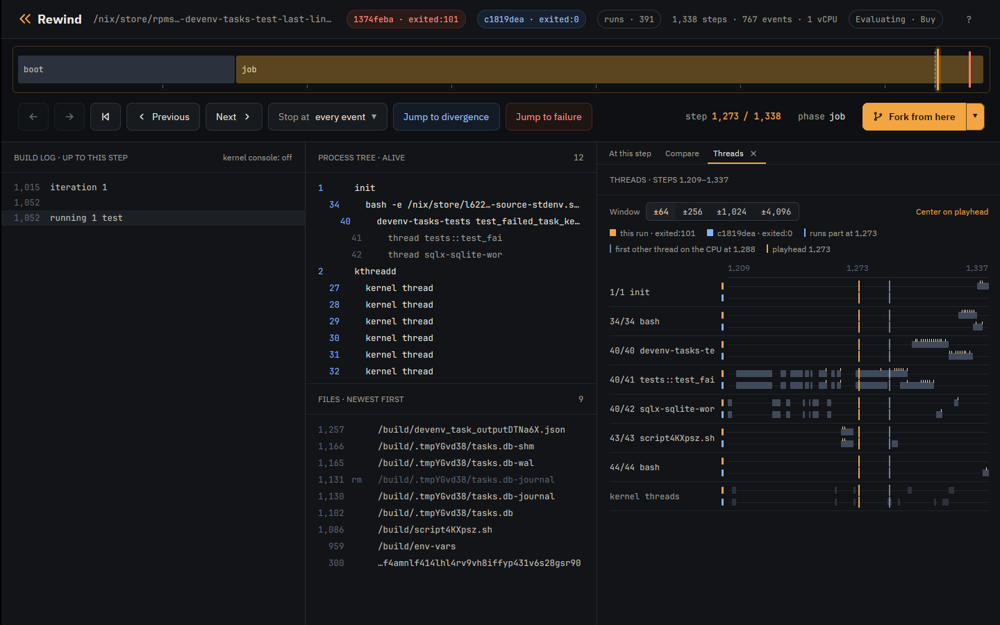

# Case study: lost task output in devenv

[devenv](https://devenv.sh/) could drop the last lines a task printed. This is
a known bug, reported in
[cachix/devenv#2281](https://github.com/cachix/devenv/issues/2281) and fixed
by the maintainer in [cachix/devenv#2296](https://github.com/cachix/devenv/pull/2296).
Rewind VM reproduced it, gdb in the VM shows `tokio::select!` taking the
child's exit with a line still buffered, and the fix passes every schedule.

## The code

`devenv-tasks` runs each task as a child process and reads its output a line
at a time in one `tokio::select!` loop
([task_state.rs at 1.10.1](https://github.com/cachix/devenv/blob/cecb0452cacd9c524ccfc973d5caffff834cbf02/devenv-tasks/src/task_state.rs#L365-L431)):

```rust {18}
        loop {
            tokio::select! {
                result = stdout_reader.next_line(), if !stdout_closed => {
                    match result {
                        Ok(Some(line)) => {
                            ...
                            stdout_lines.push((std::time::Instant::now(), line));
                        },
                        Ok(None) => {
                            stdout_closed = true;
                        },
                        ...
                    }
                }
                result = stderr_reader.next_line(), if !stderr_closed => {
                    ...
                }
                result = child.wait() => {
                    match result {
                        Ok(status) => {
                            ...
                            if status.success() {
                                return Ok(TaskCompleted::Success(now.elapsed(), Self::get_outputs(&outputs_file).await));
                            } else {
                                return Ok(TaskCompleted::Failed(
                                    now.elapsed(),
                                    TaskFailure {
                                        stdout: stdout_lines,
                                        stderr: stderr_lines,
                                        error: format!("Task exited with status: {status}"),
                                    },
                                ));
                            }
                        },
```

When the `child.wait()` branch runs, the function returns with the lines it
has so far.

## The test

The derivation adds one test to `devenv-tasks`' unit tests and runs only that
test ([flake](../../examples/case-studies/flake.nix)):

```rust
#[tokio::test]
async fn test_failed_task_keeps_last_lines() -> Result<(), Error> {
    let temp_dir = TempDir::new().unwrap();
    let db_path = temp_dir.path().join("tasks.db");
    let script = create_script("#!/bin/sh\necho line1\necho line2\necho line3\nexit 1\n")?;
    let tasks = Tasks::builder(
        Config::try_from(json!({
            "roots": ["myapp:task_1"],
            "run_mode": "all",
            "tasks": [{ "name": "myapp:task_1", "command": script.to_str().unwrap() }]
        }))
        .unwrap(),
        VerbosityLevel::Verbose,
        Shutdown::new(),
    )
    .with_db_path(db_path)
    .build()
    .await?;
    tasks.run().await;
    match inspect_tasks(&tasks).await.as_slice() {
        [(_, TaskStatus::Completed(TaskCompleted::Failed(_, failure)))] => {
            let lines: Vec<&str> = failure.stdout.iter().map(|(_, l)| l.as_str()).collect();
            assert_eq!(lines, vec!["line1", "line2", "line3"]);
        }
        other => panic!("unexpected task statuses: {other:?}"),
    }
    Ok(())
}
```

## Run it

`tokio::select!` takes its branch order from the VM's randomness, which
`--seed` sets. Seed 2 fails on the first run:

```console
$ rewind nix --seed 2 'github:fzakaria/rewindvm?dir=examples/case-studies#devenv-last-lines-before-2296'
rewind: packing 57 store paths for devenv-tasks-test-last-lines-before-2296
iteration 1

running 1 test
test tests::test_failed_task_keeps_last_lines ... FAILED

failures:

---- tests::test_failed_task_keeps_last_lines stdout ----
[myapp:task_1] line1
[myapp:task_1] line2

thread 'tests::test_failed_task_keeps_last_lines' (41) panicked at devenv-tasks/src/tests/mod.rs:3006:13:
assertion `left == right` failed
  left: ["line1", "line2"]
 right: ["line1", "line2", "line3"]
...
rewind: run 81b5bb745c2ef3e6 exited:101 after 1234 steps, 0.034s virtual, 0.346s wall (poweroff)

$ rewind replay 81b5bb74
identical: 767 events over 1234 steps
```

The task printed three lines and devenv kept two, as in the issue.

## How often it fails

```console
$ rewind check --seed 2 --all --schedules 256 'github:fzakaria/rewindvm?dir=examples/case-studies#devenv-last-lines-before-2296'
schedule   0: exited:101       1234 steps    run 81b5bb745c2ef3e6
schedule   1: exited:101       1258 steps    run a3729e93e94d6aa0
schedule   2: exited:101       1328 steps    run 60b944913ee157a1
schedule   3: exited:101       1337 steps    run dca729acfe308cb9
...
schedule 256: exited:101       1326 steps    run 46ee295f5306979b
schedule 0 failed; 50 of 256 perturbed schedules ended differently

schedule 12 passes where schedule 0 fails; narrowing the steps it perturbs
perturbing only steps 518..1270 still ends differently
step 1269 decides it: a reschedule there makes the run pass

passing: run ce9c756366a37c55, schedule 12 over steps 518..1270
failing: run f800da6bd5088cca, schedule 12 over steps 518..1269
the two are the same run until step 1269

where /nix/store/195dbbvj5h0yq9f4vnp833dsbgxpp8w0-devenv-tasks-tests-1.10.1/bin/devenv-tasks-tests test_failed_task_keeps_last_lines first behaves differently:
  both           1166    40/42    open("/build/.tmpJp3M0f/tasks.db-shm", 0o2400102)
  both           1257    40/41    open("/build/devenv_task_output26U1TT.json", 0o2000302)
  both           1264    40/41    fork() = 43
  failing        1273    40/41    SIGCHLD code=1 addr=0x0
  failing        1284    40/41    unlink("/build/devenv_task_output26U1TT.json")
  failing        1291    40/41    unlink("/build/scriptT2boZm.sh")
  failing        1292    40/41    unlink("/build/.tmpJp3M0f/tasks.db-shm")
  passing        1297    40/41    unlink("/build/devenv_task_output26U1TT.json")
  passing        1304    40/41    unlink("/build/scriptT2boZm.sh")
  passing        1305    40/41    unlink("/build/.tmpJp3M0f/tasks.db-shm")
  passing        1306    40/41    unlink("/build/.tmpJp3M0f/tasks.db-wal")

open both in the desktop app: rewind open f800da6bd5088cca 1273 --compare ce9c756366a37c55
```

207 of 257 runs fail, all with `["line1", "line2"]`. In the failing run of
the narrowed pair, the shell's SIGCHLD reaches the test's thread 41 at step
1273, before the task is done; in the passing run it does not.

## Who had the CPU

`rewind threads` prints which thread held the CPU through each stretch of
steps, here for the failing run and then the passing one:

```console
$ rewind threads f800da6bd5088cca --from 1260 --to 1300
      1260       1261         40/41  tests::test_fai
      1262       1262     kernel 11  ksoftirqd/0
      1263       1264         40/41  tests::test_fai
      1265       1270         43/43  scriptT2boZm.sh
      1271       1271     kernel 11  ksoftirqd/0
      1272       1297         40/41  tests::test_fai
      1298       1299     kernel 11  ksoftirqd/0
      1300       1300         40/40  devenv-tasks-te

$ rewind threads ce9c756366a37c55 --from 1260 --to 1300
      1260       1261         40/41  tests::test_fai
      1262       1262     kernel 11  ksoftirqd/0
      1263       1264         40/41  tests::test_fai
      1265       1270         43/43  scriptT2boZm.sh
      1271       1271     kernel 11  ksoftirqd/0
      1272       1287         40/41  tests::test_fai
      1288       1289     kernel 11  ksoftirqd/0
      1290       1292         43/43  scriptT2boZm.sh
      1293       1293     kernel 11  ksoftirqd/0
      1294       1300         40/41  tests::test_fai
```

In the failing run the shell (43) finishes exiting before thread 41 runs. In
the passing run the reschedule at step 1269 sends the shell off the CPU before
its exit is done, and it finishes only at 1290. The app's Threads tab shows
the same:



Perturbing only from step 1158, where the run forks the task's shell, gives
about the same pass rate, so the outcome is decided after the task starts:

```console
$ rewind check --run 81b5bb74 --schedule-from 1158 --schedules 64 --all --no-narrow
schedule   0: exited:101       1234 steps    run 81b5bb745c2ef3e6
schedule   1: exited:101       1250 steps    run 285a73bbf713624c
schedule   2: exited:101       1255 steps    run c4b1b4f920210e73
schedule   3: exited:101       1244 steps    run 6a936f2e9f842af7
...
schedule  64: exited:0       1286 steps  77ac62e2629d  run c8fbd031eb1c0604
run 81b5bb745c2ef3e6 failed; 15 of 64 perturbed schedules ended differently
```

## Where the third line went

The events of schedule 0's run around the task:

```console
$ rewind events 81b5bb74 --from 1150 --to 1170
      1155    40/41    open("/build/devenv_task_outputnbzDbE.json", 0o2000302)
      1158    40/41    fork() = 43
      1162    43/43    execve("/build/script08XGOT.sh", ["/bin/sh", "/build/script08XGOT.sh"])
      1163    43/43    exit_group(script08XGOT.sh) exited:1
      1166    40/41    SIGCHLD code=1 addr=0x0
```

The shell prints all three lines and exits before the loop reads anything.
`rewind gdb` opens gdb on a fork of the run at a step. Break on `read` of the
stdout pipe (fd 13) and on the `child.wait()` branch:

```console
$ rewind gdb 81b5bb74 1155 -- -batch -ex 'break read if $rdi == 13' -ex 'break task_state.rs:409' -ex continue -ex 'set $buf = $rsi' -ex finish -ex 'x/s $buf' -ex 'delete 1' -ex continue
rewind: step 1155 ran in process 40; loading symbols for 5 of its files
rewind: source files for /nix/store/195dbbvj5h0yq9f4vnp833dsbgxpp8w0-devenv-tasks-tests-1.10.1 from /nix/store/hs2328bm8f7s0cq77jjjgdlcqrc13mhm-source
rewind: gdb at step 1155 of 81b5bb745c2ef3e6
arch_local_irq_restore (flags=514) at ./arch/x86/include/asm/irqflags.h:146
146		return !(flags & X86_EFLAGS_IF);
[Switching to thread 3 (Thread 1.41)]
#0  __syscall_cancel_arch () at ../sysdeps/unix/sysv/linux/x86_64/syscall_cancel.S:56
56		ret
Breakpoint 1 at 0x7f95b0d31190: file ../sysdeps/unix/sysv/linux/read.c, line 25.
Breakpoint 2 at 0x5568a5fdf8a7: task_state.rs:409. (2 locations)

Thread 3 hit Breakpoint 1, __GI___libc_read (fd=13, buf=0x7f95ac015f20, nbytes=8192) at ../sysdeps/unix/sysv/linux/read.c:25
25	{
0x00005568a62b69bd in std::fs::{impl#9}::read (buf=Python Exception <class 'gdb.error'>: value has been optimized out
&mut [u8](size=8192), self=<optimized out>) at /rustc/48a229ceaefd4985c50990b14116b6d856af0985/library/std/src/fs.rs:1335
warning: 1335	/rustc/48a229ceaefd4985c50990b14116b6d856af0985/library/std/src/fs.rs: No such file or directory
Value returned is $1 = 18
0x7f95ac015f20:	"line1\nline2\nline3\n"

Thread 3 hit Breakpoint 2.1, devenv_tasks::task_state::{impl#1}::run::{async_fn#0}::{async_block#0}::{async_block#0} () at devenv-tasks/src/task_state.rs:415
415	                            let expanded_paths = expand_glob_patterns(&self.task.exec_if_modified);
[Inferior 1 (process 1) detached]
```

One read returns all three lines into the `BufReader`. The loop takes two of
them, then takes the `child.wait()` branch with `line3` still buffered, and
returns.

## Root cause

Without `biased;`, `tokio::select!` polls its branches in a random order on
each pass. Once the child has exited, `child.wait()` is ready on every pass,
and so is each buffered line. Each pass is a draw between "take the next line"
and "return now", and any line still buffered when `child.wait()` wins is
lost.

The window opens when the exit is visible before the output is read. On one
CPU the shell often runs from `execve` to `exit` without giving up the CPU, so
the output and the exit are waiting together when the loop starts.

## The fix, checked

The fix
([de0dc6a8](https://github.com/cachix/devenv/commit/de0dc6a85ae88eb8194c2f7e053f3e933b77c2ac))
stores the exit status, turns the `child.wait()` branch off, and keeps
reading until both pipes are closed:

```diff
         loop {
+            // If child has exited and both pipes are closed, we're done
+            if exit_status.is_some() && stdout_closed && stderr_closed {
+                break;
+            }
+
             tokio::select! {
...
-                result = child.wait() => {
+                result = child.wait(), if exit_status.is_none() => {
...
-                            if status.success() {
-                                return Ok(TaskCompleted::Success(now.elapsed(), Self::get_outputs(&outputs_file).await));
-                            } else {
-                                ...
-                            }
+                            // Store exit status and continue draining pipes
+                            exit_status = Some(status);
```

The same test at the merge commit passes every schedule:

```console
$ rewind check --seed 2 --all --schedules 256 'github:fzakaria/rewindvm?dir=examples/case-studies#devenv-last-lines-2296'
rewind: packing 57 store paths for devenv-tasks-test-last-lines-2296
schedule   0: exited:0       1259 steps  77ac62e2629d  run cf2425f775f0be3d
schedule   1: exited:0       1297 steps  77ac62e2629d  run 526f8e3e7b7947a2
schedule   2: exited:0       1355 steps  77ac62e2629d  run 467780b75b06c24a
...
0 of 256 perturbed schedules ended differently
same result under all 257 schedules
```

On the host the unfixed test passed 1000 of 1000 runs on 16 CPUs, and 1000 of
1000 pinned to one CPU.

## The recording

Both files are in the
[case-studies release](https://github.com/fzakaria/rewindvm/releases/tag/case-studies):

- [devenv-task-output-race.rwd](https://github.com/fzakaria/rewindvm/releases/download/case-studies/devenv-task-output-race.rwd)
  (10.0 KB), the trace, for `rewind events`, `rewind log` and the app.
- [devenv-task-output-race-replayable.rwd](https://github.com/fzakaria/rewindvm/releases/download/case-studies/devenv-task-output-race-replayable.rwd)
  (185.1 MB), with the kernel, input image and keyframes, for `rewind replay`,
  `rewind gdb` and `rewind shell`.

```console
$ rewind import https://github.com/fzakaria/rewindvm/releases/download/case-studies/devenv-task-output-race-replayable.rwd
$ rewind replay 81b5bb74
$ rewind gdb 81b5bb74 1155
$ rewind-app https://github.com/fzakaria/rewindvm/releases/download/case-studies/devenv-task-output-race.rwd
```
