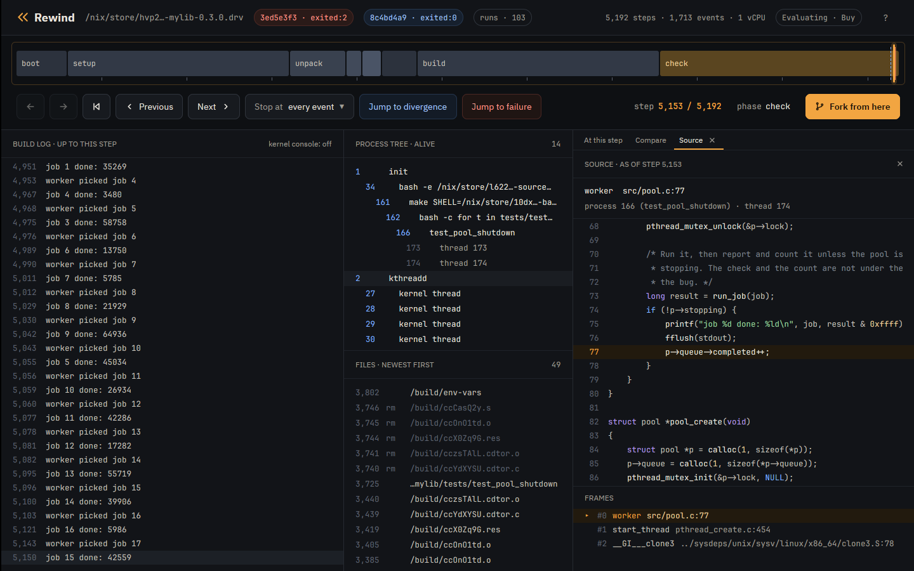
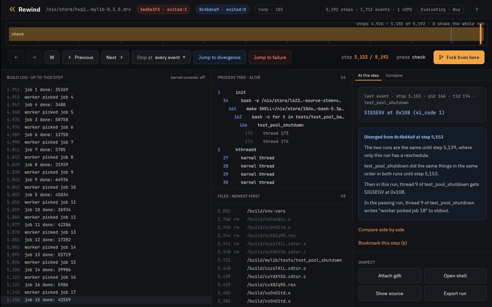
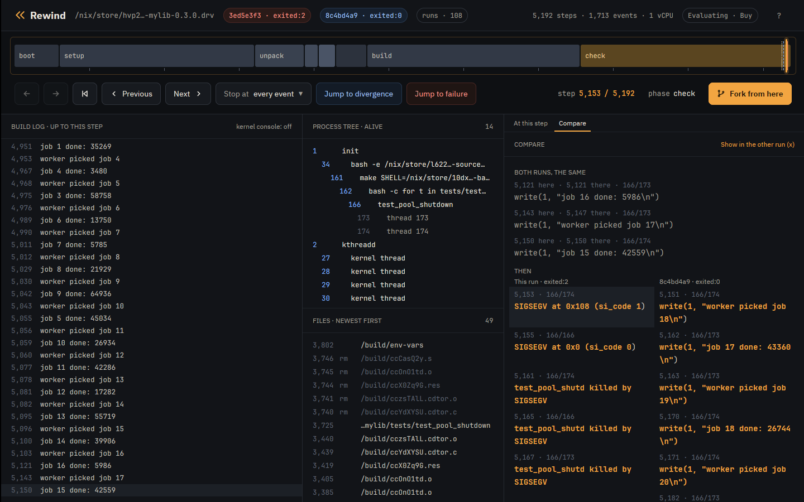
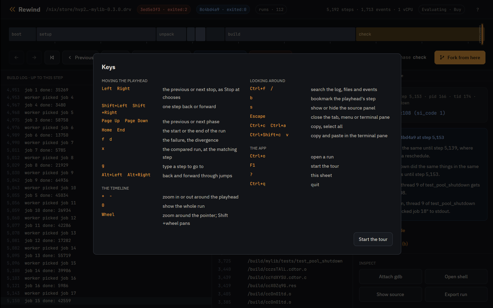

# Tutorial: advanced features

Short recipes for what the [Nix](tutorial-nix.md) and
[container](tutorial-container.md) tutorials leave out, each in the terminal
and in the desktop app. They use the Nix tutorial's runs and install.

## The runs

```console
$ rewind check --epoch 1790985600 github:fzakaria/rewindvm#mylib | grep -E 'ends differently|perturbing only|decides it|passing:|failing:|same run until|open both'
rewind: packing 62 store paths for mylib-0.3.0
schedule 6 ends differently; narrowing the steps it perturbs
perturbing only steps 3629..5140 still ends differently
step 5139 decides it: a reschedule there makes the run fail
passing: run 8c4bd4a91be9cbeb, schedule 6 over steps 3629..5139
failing: run 3ed5e3f30d73bb41, schedule 6 over steps 3629..5140
the two are the same run until step 5139
open both in the desktop app: rewind open 3ed5e3f30d73bb41 5153 --compare 8c4bd4a91be9cbeb
```

The failing run crashes at step 5153.

## Find the line a thread was on

`rewind where` names the line of the program's own code a thread was on at a
step, past the C library and, in Rust, the standard library and
dependencies. By default it looks at the thread of the step's own event, the
pid/tid pair `rewind events` prints; at 5153 that is the worker that
segfaulted:

```console
$ rewind where 3ed5e3f3 5153
rewind: process 166 at step 5153; loading symbols for 4 of its files
rewind: fetched 3 source files from the VM
rewind: walking thread 174's stack in gdb
rewind: downloading debug info for libc.so.6; first time only
rewind: downloading debug info for libpthread.so.0; first time only
rewind: downloading debug info for ld-linux-x86-64.so.2; first time only
rewind: downloading debug info for [vdso]; first time only
rewind: downloading the sources of libc.so.6; first time only
process 166 (test_pool_shutdown), thread 174, at step 5153
#0 worker (src/pool.c:77)
      75  			printf("job %d done: %ld\n", job, result & 0xffff);
      76  			fflush(stdout);
>     77  			p->queue->completed++;
      78  		}
      79  	}
called from #1 start_thread (pthread_create.c:454)
called from #2 __GI___clone3 (../sysdeps/unix/sysv/linux/x86_64/clone3.S:78)
```

`--tid` picks another thread, on the CPU or not. At step 5150, the
worker's last write, the main thread is waiting to join the workers:

```console
$ rewind where 3ed5e3f3 5150 --tid 166
rewind: process 166 at step 5150; loading symbols for 4 of its files
rewind: read 3 source files fetched from the VM earlier
rewind: walking thread 166's stack in gdb
rewind: downloading the sources of libc.so.6; first time only
process 166 (test_pool_shutdown), thread 166, at step 5150
#7 pool_shutdown (src/pool.c:128)
     126
     127  	for (int i = 0; i < POOL_WORKERS; i++)
>    128  		pthread_join(p->workers[i], NULL);
     129  	pthread_cond_destroy(&p->ready);
     130  	pthread_mutex_destroy(&p->lock);
called from #8 main (tests/test_pool_shutdown.c:24)
called from #9 __libc_start_call_main (../sysdeps/nptl/libc_start_call_main.h:59)
```

`--json` prints every frame and which one was chosen. For every frame of
every thread, ask gdb for all the stacks of the process:

```console
$ rewind gdb 3ed5e3f3 5150 --pid 166 -- -batch -ex 'thread apply all bt' 2>/dev/null | grep -E '^Thread|src/|tests/'
Thread 4 (Thread 1.174 (test_pool_shutd, on the CPU)):
#14 worker (arg=0x5556f833c010) at src/pool.c:75
Thread 3 (Thread 1.173 (test_pool_shutd)):
#5  0x00005556d620d3a9 in run_job (job=17) at src/pool.c:45
#6  worker (arg=0x5556f833c010) at src/pool.c:73
Thread 2 (Thread 1.166 (test_pool_shutd)):
#7  0x00005556d620d5b3 in pool_shutdown (p=p@entry=0x5556f833c010) at src/pool.c:128
#8  0x00005556d620d272 in main () at tests/test_pool_shutdown.c:24
Thread 1 (Thread 1.4194305 (the CPU, in test_pool_shutd 174)):
```

`rewind gdb` starts in the thread `rewind where` looks at, in its innermost
frame. `--tid` and `--frame` start it elsewhere, with frames numbered as
`where --json` numbers them. In the main thread's frame that `where` chose,
`pool_shutdown` has already set the queue to NULL:

```console
$ rewind gdb 3ed5e3f3 5150 --tid 166 --frame 7 -- -batch -ex 'p p->queue'
rewind: process 166 at step 5150; loading symbols for 4 of its files
rewind: read 3 source files fetched from the VM earlier
rewind: gdb at step 5150 of 3ed5e3f30d73bb41
arch_local_irq_restore (flags=518) at ./arch/x86/include/asm/irqflags.h:146
146		return !(flags & X86_EFLAGS_IF);
[Switching to thread 2 (Thread 1.166)]
#0  __syscall_cancel_arch () at ../sysdeps/unix/sysv/linux/x86_64/syscall_cancel.S:56
56		ret
#7  0x00005556d620d5b3 in pool_shutdown (p=p@entry=0x5556f833c010) at src/pool.c:128
128			pthread_join(p->workers[i], NULL);
$1 = (struct queue *) 0x0
[Inferior 1 (process 1) detached]
```

`where` and gdb read each thread's registers from the VM kernel's task list,
so they work on runs recorded with a guest that lists its tasks, as these
were.

In the app, Show source under Inspect, or the s key, opens the source panel
in a tab beside At this step. It names the line `rewind where` would for the
thread of the playhead's event and shows that line's whole source file,
syntax colored, scrolled so the line, marked, sits in the middle. The thread's frames are
listed below the file, with the chosen one marked; dragging the list's top
edge makes it taller for a deep stack.
Clicking another frame shows its file instead, scrolled to its line and
marked; a frame without source shows its address and program. A file over a
mebibyte comes as the lines around its frames' lines, and the panel says
which. Long lines scroll sideways with Shift and the wheel, or a sideways
swipe, while the line numbers stay put. When the playhead rests on another step the panel
asks again, back at the chosen frame, dimming the last answer meanwhile; each
answer forks the run, so it takes a few seconds. Runs the app cannot fork
say so instead: the bundled example and an export that holds only the trace.
So does a run recorded before the guest listed its tasks, which has to be
recorded again.



## Find the step that decides it

`check` narrows the failing schedule to the steps from 3629 to
5139, and names the last of them. Its passing run is the same
schedule without that one step, so the two runs are the same machine until
step 5139, where only the failing run gets a reschedule, and
everything they do differently follows from it. `rewind where` names the
thread that was on the CPU there:

```console
$ rewind where 3ed5e3f3 5139
rewind: process 166 at step 5139; loading symbols for 4 of its files
rewind: read 3 source files fetched from the VM earlier
rewind: walking thread 166's stack in gdb
rewind: downloading the sources of libc.so.6; first time only
process 166 (test_pool_shutdown), thread 166, at step 5139
#5 main (tests/test_pool_shutdown.c:23)
      21  			pool_submit(p, i);
      22  		while (pool_completed(p) < JOBS / 2)
>     23  			usleep(100);
      24  		pool_shutdown(p);
      25  		printf("round %d: ok\n", round);
called from #6 __libc_start_call_main (../sysdeps/nptl/libc_start_call_main.h:59)
called from #7 __libc_start_main_impl (../csu/libc-start.c:372)
```

The test's main thread was waiting for half the jobs to finish before it
shuts the pool down. A worker checks `p->stopping` without the lock and then
counts its job through `p->queue`, which `pool_shutdown` frees. After the
reschedule at step 5139, the main thread sets the queue to NULL
between a worker's check and its count, and the worker faults on it
14 steps later. Without it, the worker counts first and the test passes.

`check --where` looks both threads up itself: the one on the CPU at the
deciding step, and the one of the failing run's first event that differs,
each by the line of the program's own code it was on. Each lookup takes a fork
and gdb, so it is a flag:

```console
$ rewind check --where --epoch 1790985600 github:fzakaria/rewindvm#mylib 2>/dev/null | sed -n '/^where the threads were/,/first event that differs$/p'
where the threads were:
        5139   166/166   main (tests/test_pool_shutdown.c:23), on the CPU at the deciding step
        5153   166/174   worker (src/pool.c:77), at the first event that differs
```

In the app, two runs that differ only in their schedules show the step where
the schedules part as a dashed blue mark on the timeline, before the solid
one where their events first differ. Pointing at it says what only one of
them got there, a click takes the playhead to it, and the divergence card's
first line says the same. Opening a window `check` narrowed, from the Runs
panel or from the list of builds, compares it with the window one step
shorter, as `check` does. Zoomed in with + around the crash:



## Watch both sides of the race

A watchpoint finds who freed the queue the crash reads. Break in a worker so
`p` is in scope, watch `p->queue`, and continue:

```console
$ rewind gdb 3ed5e3f3 5103 -- -batch -ex 'break src/pool.c:74' -ex continue -ex 'watch -l p->queue' -ex 'delete 1' -ex continue -ex 'bt 2' -ex 'break src/pool.c:77 if p->queue == 0' -ex continue -ex 'bt 1'
rewind: step 5103 ran in process 166; loading symbols for 4 of its files
rewind: read 3 source files fetched from the VM earlier
rewind: gdb at step 5103 of 3ed5e3f30d73bb41
arch_local_irq_restore (flags=518) at ./arch/x86/include/asm/irqflags.h:146
146		return !(flags & X86_EFLAGS_IF);
[Switching to thread 3 (Thread 1.173)]
#0  __syscall_cancel_arch () at ../sysdeps/unix/sysv/linux/x86_64/syscall_cancel.S:56
56		ret
Breakpoint 1 at 0x5556d620d3a9: file src/pool.c, line 74.

Thread 3 hit Breakpoint 1, worker (arg=0x5556f833c010) at src/pool.c:74
74			if (!p->stopping) {
Hardware watchpoint 2: -location p->queue
[Switching to Thread 1.166]

Thread 2 hit Hardware watchpoint 2: -location p->queue

Old value = (struct queue *) 0x5556f833c090
New value = (struct queue *) 0x0
pool_shutdown (p=p@entry=0x5556f833c010) at src/pool.c:128
128			pthread_join(p->workers[i], NULL);
#0  pool_shutdown (p=p@entry=0x5556f833c010) at src/pool.c:128
#1  0x00005556d620d272 in main () at tests/test_pool_shutdown.c:24
Breakpoint 3 at 0x5556d620d433: file src/pool.c, line 77.
[Switching to Thread 1.174]

Thread 4 hit Breakpoint 3, worker (arg=0x5556f833c010) at src/pool.c:77
77				p->queue->completed++;
#0  worker (arg=0x5556f833c010) at src/pool.c:77
[Inferior 1 (process 1) detached]
```

The first stop is `main` nulling the queue in `pool_shutdown`, the second the
worker reading it. Watchpoints are the CPU's four debug registers, so the VM
runs at full speed until one fires. `watch` and `awatch` work; x86 has no
`rwatch`. At user addresses they stop only in the process gdb started in.

In the app, Attach gdb opens the same session under the timeline:


## Follow the fault into the kernel

`rewind gdb` has the VM kernel's symbols too. Stop where the kernel sends the
SIGSEGV, and use its own gdb scripts:

```console
$ rewind gdb 3ed5e3f3 5150 -- -batch -ex 'break force_sig_fault' -ex continue -ex 'bt 4' -ex 'pipe lx-ps | tail -4' -ex 'pipe lx-dmesg | tail -2'
rewind: step 5150 ran in process 166; loading symbols for 4 of its files
rewind: read 3 source files fetched from the VM earlier
rewind: gdb at step 5150 of 3ed5e3f30d73bb41
arch_local_irq_restore (flags=518) at ./arch/x86/include/asm/irqflags.h:146
146		return !(flags & X86_EFLAGS_IF);
[Switching to thread 4 (Thread 1.174)]
#0  __syscall_cancel_arch () at ../sysdeps/unix/sysv/linux/x86_64/syscall_cancel.S:56
56		ret
Downloading 133.41 K source file /build/linux-7.2.8/kernel/signal.c...
Breakpoint 1 at 0xffffffff812c38b0: file kernel/signal.c, line 1757.
[Switching to Thread 1.4194305]

Thread 1 hit Breakpoint 1, force_sig_fault (sig=11, code=1, addr=0x108) at kernel/signal.c:1757
1757	{
#0  force_sig_fault (sig=11, code=1, addr=0x108) at kernel/signal.c:1757
#1  0xffffffff81e70490 in handle_page_fault (regs=0xffffc900001f3f58, error_code=6, address=264) at arch/x86/mm/fault.c:1483
#2  exc_page_fault (regs=0xffffc900001f3f58, error_code=6) at arch/x86/mm/fault.c:1536
#3  0xffffffff810012a6 in asm_exc_page_fault () at ./arch/x86/include/asm/idtentry.h:595
0xffff888003bbcec0  162  bash
0xffff888003810000  166  test_pool_shutd
0xffff888003bbee40  173  test_pool_shutd
0xffff888003811f80  174  test_pool_shutd
[    0.202817] test_pool_shutd[174]: segfault at 108 ip 00005556d620d437 sp 00007feee6e68e10 error 6 in test_pool_shutdown[1437,5556d620d000+1000] likely on CPU 0 (core 0, socket 0)
[    0.202822] Code: fa 48 8d 35 2a 0c 00 00 bf 02 00 00 00 b8 00 00 00 00 e8 ac fc ff ff 48 8b 05 b5 2b 00 00 48 8b 38 e8 8d fc ff ff 49 8b 46 58 <83> 80 08 01 00 00 01 e9 b5 fe ff ff 55 48 89 e5 41 54 53 be 78 00
[Inferior 1 (process 1) detached]
```

The kernel's DWARF comes from `rewindvm.cachix.org` with Nix, and from the
debug tarball next to `rewind` without. The app's build log shows the kernel's
messages beside the program's with kernel console on:


## Use your own gdb

`--listen` serves the fork for a gdb started elsewhere, such as an IDE's, and
prints the command line that loads the same symbols:

```console
$ rewind gdb 3ed5e3f3 5153 --listen 127.0.0.1:1234
rewind: step 5153 ran in process 166; loading symbols for 4 of its files
rewind: read 3 source files fetched from the VM earlier
rewind: gdb at step 5153 of 3ed5e3f30d73bb41; connect with: gdb -q -iex 'set debuginfod enabled on' -iex 'set debuginfod urls http://127.0.0.1:43765' -ex 'file /nix/store/c9z53nkphz0zaan797qgmydxslw4l5bi-rewind-guest-kernel-7.2.8- ...
```

## Bring tools into the VM

`rewind shell --with` adds a Nix package to the shell, without changing the
run. Here binutils disassembles the faulting instruction:

```console
$ printf 'objdump -d --no-show-raw-insn --start-address=0x142c --stop-address=0x143e tests/test_pool_shutdown | tail -4; exit\n' | rewind shell 3ed5e3f3 5153 --pid 166 --with nixpkgs#binutils
rewind: packing 21 store paths for --with
rewind: a shell at step 5153 of 3ed5e3f30d73bb41; exit it to leave
[rewind] /build/mylib # objdump -d --no-show-raw-insn --start-address=0x142c --stop-address=0x143e tests/test_pool_shutdown | tail -4; exit
    142c:	mov    (%rax),%edi
    142e:	call   10c0 <fflush@plt>
    1433:	mov    0x58(%r14),%rax
    1437:	addl   $0x1,0x108(%rax)
```

## Give programs more CPUs

The VM has one vCPU, so by default programs see one CPU and Nix builds run
one job at a time. `--cores` tells them there are more, and the extra threads
interleave on the one vCPU:

```console
$ rewind nix --cores 4 --epoch 1790985600 github:fzakaria/rewindvm#mylib
...
rewind: run c2dcda95802e9b88 exited:0 after 6174 steps, 0.216s virtual, 1.100s wall (poweroff)
/nix/store/f6a9gy362szw6nxx3ikrklr8glr6rdln-mylib-0.3.0 a9d703ba89774f3d  matches your store, rewindvm.cachix.org
```

```console
$ printf 'nproc; echo $NIX_BUILD_CORES; exit\n' | rewind shell c2dcda95 2467 --pid 110
rewind: a shell at step 2467 of c2dcda95802e9b88; exit it to leave
[rewind] /build/mylib # nproc; echo $NIX_BUILD_CORES; exit
4
4
```

Run Go programs with `GOMAXPROCS=1` above one core: Go's garbage collector
spins waiting for a thread that never runs.

## Steer the perturbation

`check --schedules N` tries more or fewer schedules, `--all` all of them.
`rewind fork` asks which schedules fail from a given step:

```console
$ rewind fork 3ed5e3f3 5123 --schedule 1 --quiet
rewind: run 0a18bfa4106b10ea exited:0 after 6766 steps, 0.226s virtual, 0.328s wall (poweroff)
rewind: the fork first differs from its parent at step 5151
rewind: open it beside its parent in the desktop app: rewind open 0a18bfa4106b10ea 5151 --compare 3ed5e3f30d73bb41

$ rewind fork 3ed5e3f3 5123 --schedule 2 --quiet
rewind: run 217f5d98224a4a60 exited:2 after 5204 steps, 0.203s virtual, 0.263s wall (poweroff)
rewind: the fork first differs from its parent at step 5151
rewind: open it beside its parent in the desktop app: rewind open 217f5d98224a4a60 5151 --compare 3ed5e3f30d73bb41

$ rewind fork 3ed5e3f3 5123 --schedule 3 --quiet
rewind: run a62e1bc38700fde6 exited:2 after 5202 steps, 0.203s virtual, 0.266s wall (poweroff)
rewind: the fork first differs from its parent at step 5142
rewind: open it beside its parent in the desktop app: rewind open a62e1bc38700fde6 5142 --compare 3ed5e3f30d73bb41

$ rewind fork 3ed5e3f3 5123 --schedule 4 --quiet
rewind: run 383acd539d9e1313 exited:2 after 5236 steps, 0.204s virtual, 0.262s wall (poweroff)
rewind: the fork first differs from its parent at step 5148
rewind: open it beside its parent in the desktop app: rewind open 383acd539d9e1313 5148 --compare 3ed5e3f30d73bb41
```

The app's Runs tab, or the runs pill in its header, shows every run of the
build, with forks under the run and step they branched from:


The Fork from here button forks the run at the playhead with the next
schedule. A fork of a long run takes about as long as the run did: while forks
made from the window run, the button's icon turns, and the Runs panel lists
each fork as running, in a pulsing pill, until it ends and the panel shows
how. Clicking a run opens it compared with the run it hangs under.
Right-clicking one offers to compare every run with it instead, to copy its id
or to delete it with its forks; Ctrl and Shift pick several. Forks that ran
exactly as an older one did go in one click, with remove identical in the
panel's header.

## Find a run again

A command takes a run by its id or the start of one, by `@` for the newest
run and `@2`, `@3` and on for the ones before it, by a name for the newest
run with that name, or by its directory. `rewind ls` lists runs newest first,
and filters them:

```console
$ rewind ls -n 3
383acd539d9e1313  exited:2          5236 steps  mylib-0.3.0 (fork of 3ed5e3f30d73bb41 at 5123, schedule 4)
a62e1bc38700fde6  exited:2          5202 steps  mylib-0.3.0 (fork of 3ed5e3f30d73bb41 at 5123, schedule 3)
217f5d98224a4a60  exited:2          5204 steps  mylib-0.3.0 (fork of 3ed5e3f30d73bb41 at 5123, schedule 2)

$ rewind ls --forks-of 3ed5e3f3 --status failed
383acd539d9e1313  exited:2          5236 steps  mylib-0.3.0 (fork of 3ed5e3f30d73bb41 at 5123, schedule 4)
a62e1bc38700fde6  exited:2          5202 steps  mylib-0.3.0 (fork of 3ed5e3f30d73bb41 at 5123, schedule 3)
217f5d98224a4a60  exited:2          5204 steps  mylib-0.3.0 (fork of 3ed5e3f30d73bb41 at 5123, schedule 2)
```

`--name mylib` keeps the runs whose name contains `mylib`, and `--since` the
runs made in the last `30m`, `2h` or `7d`, or since a day such as
`2026-10-01`.
`--status` takes `passed`, `failed`, `timed-out`, `running`, `interrupted` or
`unreadable`, and `failed` takes timed-out runs too. A Nix run is named after
its derivation, and `--name` names any run.

`rewind open` starts the app on a run, at a step and beside another run.
`check` and `fork` print the command that opens what they made, as the last
line of `check` above shows. The failing run at the crash, beside the passing
one:

```console
$ rewind open 3ed5e3f3 5153 --compare 8c4bd4a9
```

## Rebuild a run exactly

A run's id is the hash of its inputs, which its `manifest.json` lists, so the
same command makes the same run on a machine with the same CPU vendor and
guest. `rewind show` prints that command with every input spelled out, the
epoch above all, which by default is the start of the day the run was made.
For a fork it prints its parents' commands first, each with the id it makes.
`@`, the newest run, is the schedule 4 fork:

```console
$ rewind show @
383acd539d9e1313  exited:2          5236 steps  mylib-0.3.0 (fork of 3ed5e3f30d73bb41 at 5123, schedule 4)
recorded by rewind 0.5.0 (04e7139a26ff)
rewind nix /nix/store/...-mylib-0.3.0.drv --epoch 1790985600 --schedule 6 --schedule-from 3629 --schedule-until 5140 --clock branches --name mylib-0.3.0  # 3ed5e3f30d73bb41
rewind fork 3ed5e3f30d73bb41 5123 --schedule 4  # 383acd539d9e1313
```

The failing run's command makes it again, with the same id:

```console
$ rewind show 3ed5e3f3 | tail -1 | sh
...
rewind: run 3ed5e3f30d73bb41 exited:2 after 5192 steps, 0.203s virtual, 0.580s wall (poweroff)
```

## Compare any two runs

`rewind diff` compares every event of two runs, where `check` compares only
the failing program's:

```console
$ rewind diff 8c4bd4a9 3ed5e3f3
first difference at event 1688: step 5147 on the left, step 5143 on the right
  both        5100   166/173   write(1, "job 14 done: 39906\n")
  both        5103   166/173   write(1, "worker picked job 16\n")
  both        5121   166/173   write(1, "job 16 done: 5986\n")
  left        5147   166/173   write(1, "worker picked job 17\n")
  left        5150   166/174   write(1, "job 15 done: 42559\n")
  left        5151   166/174   write(1, "worker picked job 18\n")
  left        5162   166/173   write(1, "job 17 done: 43360\n")
  right       5143   166/173   write(1, "worker picked job 17\n")
  right       5150   166/174   write(1, "job 15 done: 42559\n")
  right       5151     0/0     console "[    0.202816] test_pool_shutd[174]: segfault at 108 ip 00005556d620d437 sp 00007feee6e68e10 error 6 in test_pool_shutdown[1437,5556d620d000+1000] likely on CPU 0 (core 0, socket 0)"
  right       5152     0/0     console "[    0.202821] Code: fa 48 8d 35 2a 0c 00 00 bf 02 00 00 00 b8 00 00 00 00 e8 ac fc ff ff 48 8b 05 b5 2b 00 00 48 8b 38 e8 8d fc ff ff 49 8b 46 58 <83> 80 08 01 00 00 01 e9 b5 fe ff ff 55 48 89 e5 41 54 53 be 78 00"
```

In the app, any run compared with another shows where they part, on the
timeline and in the divergence card:


The card's link, Compare side by side, opens the Compare tab beside At this
step. It lists the last events both runs had, once each with both runs'
steps, then each run's next events side by side and in full, with the part of
each pair that differs in amber. A click on this run's event moves the
playhead there. A click on the other run's, Show in the other run, or the x
key puts the compared run on screen in this one's place, at the matching step
and compared with this one, so x again comes back:



## Script it

`run`, `nix` and `fork` exit with the job's status, as a shell would report
it, so a shell loop can ask which schedules fail from a step:

```console
$ for s in 5 6 7 8; do rewind fork 3ed5e3f3 5123 --schedule $s --quiet 2>/dev/null; echo "schedule $s: exit $?"; done
schedule 5: exit 0
schedule 6: exit 2
schedule 7: exit 2
schedule 8: exit 2
```

`check` exits 1 when a schedule ends differently and 0 when none does, `diff`
1 when the runs differ, `cat` 3 when the file did not exist at the step, and
`doctor` 1 when this machine cannot record runs. With `--json`, commands
print JSON for a program to read in place of their text: one object, or from
`ls` and `events` one a line.

```console
$ rewind ls --forks-of 3ed5e3f3 --status failed --json | jq -r .id
230b2cca8ca2ef0e
91b136461428f080
a4f0407b01429d73
383acd539d9e1313
a62e1bc38700fde6
217f5d98224a4a60

$ rewind diff 8c4bd4a9 3ed5e3f3 --json | jq -c '.divergence | {left_step, right_step}'
{"left_step":5147,"right_step":5143}
```

## Move around a long run

Builds of larger projects run to hundreds of thousands of steps. In the app,
the step readout is a field: click it, or press g, and type a step such as
3,495, or +100 or -100 to move from the playhead. Previous and Next, and the
Left and Right keys, stop where the Stop at chooser beside them says: at every
event, the build log's lines, processes starting and exiting, the bookmarks,
or the thread, process, kind of event or file of the event at the playhead. A
click on the step beside a log line or a file, or on a process, goes to its
step.

Alt+Left and Alt+Right, or the mouse's back and forward buttons, go back and
forward through jumps, so a press of f or d can be undone. The b key
bookmarks the playhead's step with a note: the timeline marks it, the
Bookmarks tab lists every bookmark, and they are kept with the run. Ctrl+F or
/ searches the build log, the kernel's console, file paths and events, and
lists the matches by step.

The wheel over the timeline zooms around the pointer, down to 16 steps
across; Shift and the wheel pan, + and - zoom around the playhead, and 0 shows
the whole run. A label names the step under the pointer. The ? key, or the ?
button in the header, opens the sheet of every key:



## Hand a failure to someone else

```console
$ rewind export 3ed5e3f3 --replayable -o crash.rwd
rewind: wrote crash.rwd (201.3 MB)

$ REWIND_HOME=elsewhere rewind import crash.rwd
3ed5e3f30d73bb41  exited:2          5192 steps  mylib-0.3.0

$ REWIND_HOME=elsewhere rewind replay 3ed5e3f3
identical: 1713 events over 5192 steps
```

A replayable export carries the keyframes, the image and the VM's kernel, and
replays on any machine with the same CPU vendor. Without `--replayable` it is
the events alone, 17.8 KB: enough to read and to scrub in the app, whose
Export button writes the replayable kind. Either kind carries the run's
bookmarks from the app, notes included.

## Which clock

```console
$ rewind pmu status
cpu: AMD Zen (family 25)
amd workaround (MSR 0xc0011020 bit 54): set by `rewind pmu enable` this boot
perf_event_paranoid: 2
self-test: 40046500 and 40046500 branches, exact at every exit
runs will use counter time
```

With counter time the VM's clock follows the work done inside it; with exit
time computation takes no virtual time. `--clock` picks one. [Counter
time](pmu.md) explains. `rewind doctor` checks the clock with KVM, gdb and
the rest of what rewind uses, and says what to do about each problem.

## Find where a run hung

A thread gives up the VM's one CPU only at a step, so a loop that makes no
system call keeps it, and the run hangs. `--timeout` stops a run after that
many seconds on your machine. When the guest had gone a second or more
without an exit, rewind says where it was stuck. A program that spins, built
static with its symbols:

```console
$ printf 'volatile unsigned long n;\nint main(void) { for (;;) n++; }\n' > spin.c
$ mkdir -p spin/bin
$ nix shell nixpkgs#pkgsStatic.stdenv.cc -c x86_64-unknown-linux-musl-cc -static -g -o spin/bin/spin spin.c
```

```console
$ rewind run --root spin --timeout 5 --name spin -- /bin/spin
rewind: run adddf6a8e32d3b29 timed-out after 308 steps, 0.002s virtual, 5.008s wall (timed out computing without exits for 4.4s, in user space in main+15 (spin.c:2), process 34 (spin))
```

The place is a function, offset and source line from the program's symbols,
and the process the VM's kernel had on the CPU. A run that timed out while
still making exits was slow rather than stuck, and says so. `rewind check`
gives each perturbed schedule ten times as long as schedule 0 took, and at
least a minute, and names the place the same way for a schedule that hit its
limit. `--status timed-out` lists such runs:

```console
$ rewind ls --status timed-out
adddf6a8e32d3b29  timed-out          308 steps  spin
```

## Keep the run directory tidy

Runs live under `~/.local/share/rewind`, or `REWIND_HOME`:

```console
$ REWIND_HOME=elsewhere rewind ls
217f5d98224a4a60  exited:2          5204 steps  mylib-0.3.0 (fork of 3ed5e3f30d73bb41 at 5123, schedule 2)
0a18bfa4106b10ea  exited:0          6766 steps  mylib-0.3.0 (fork of 3ed5e3f30d73bb41 at 5123, schedule 1)
3ed5e3f30d73bb41  exited:2          5192 steps  mylib-0.3.0

$ REWIND_HOME=elsewhere rewind remove 217f5d98
removed 217f5d98224a4a60
rewind: `rewind gc` removes the pages no run uses any more
```

`remove` takes a run with every run forked from it, and takes many runs in
one call. Every fork goes, and the runs they were forked from stay, with
`rewind ls | awk '/fork of/ {print $1}' | xargs rewind remove`.
`prune --identical` removes forks that ran exactly as an older one did.

## What to read next

- [Design](design.md): how the machine is made deterministic, and its
  [limits](design.md#limits).
- The [case studies](case-studies/nix-gc-closure-sigpipe.md): these tools on
  bugs in real projects.
