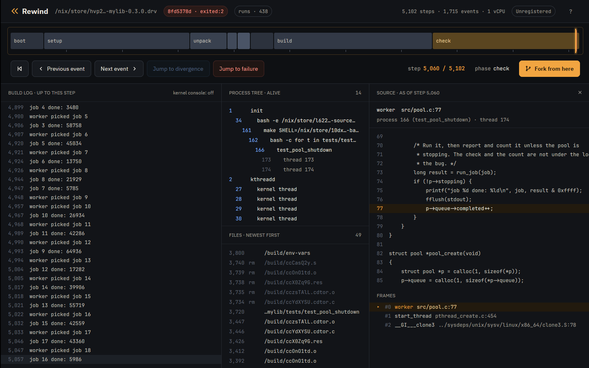
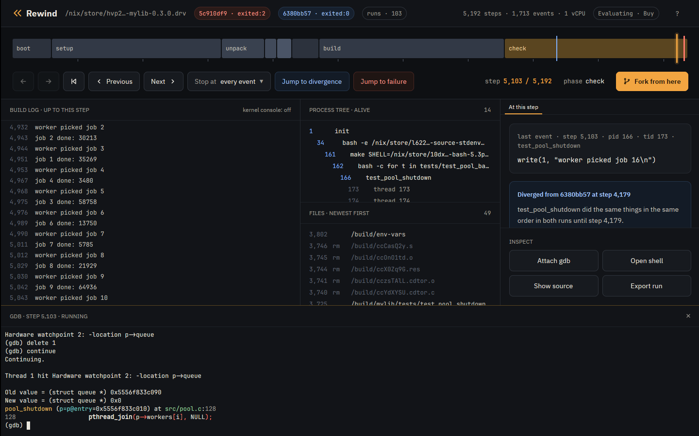
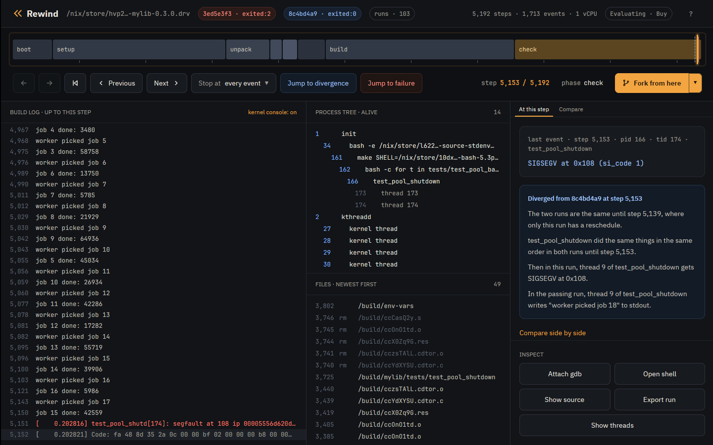
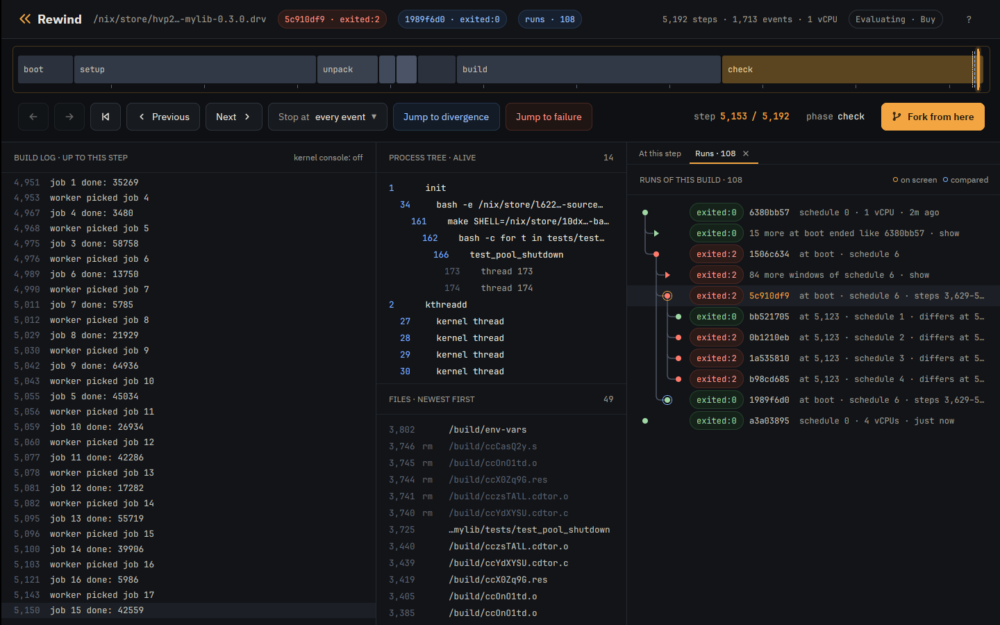
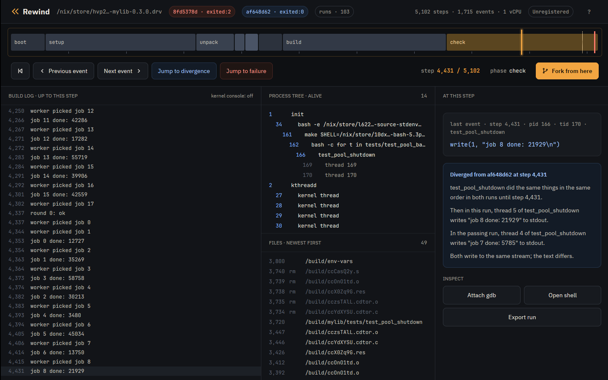

# Tutorial: advanced features

Short recipes for what the [Nix](tutorial-nix.md) and
[container](tutorial-container.md) tutorials leave out, each in the terminal
and in the desktop app. They use the Nix tutorial's runs and install.

## The runs

```console
$ rewind check --epoch 1790985600 github:fzakaria/rewindvm#mylib | grep -E 'ends differently|perturbing only|passing:|failing:'
rewind: packing 62 store paths for mylib-0.3.0
schedule 1 ends differently; narrowing the steps it perturbs
perturbing only steps 4396..5048 still ends differently
passing: run af648d629627479e
failing: run 8fd5378ddf70075e
```

The failing run crashes at step 5060.

## Find the line a thread was on

`rewind where` names the line of the program's own code a thread was on at a
step, past the C library and, in Rust, the standard library and
dependencies. By default it looks at the thread of the step's own event, the
pid/tid pair `rewind events` prints; at 5060 that is the worker that
segfaulted:

```console
$ rewind where 8fd5378d 5060
rewind: process 166 at step 5060; loading symbols for 4 of its files
rewind: fetched 3 source files from the VM
rewind: walking thread 174's stack in gdb
process 166 (test_pool_shutdown), thread 174, at step 5060
#0 worker (src/pool.c:77)
      75  			printf("job %d done: %ld\n", job, result & 0xffff);
      76  			fflush(stdout);
>     77  			p->queue->completed++;
      78  		}
      79  	}
called from #1 start_thread (pthread_create.c:454)
called from #2 __GI___clone3 (../sysdeps/unix/sysv/linux/x86_64/clone3.S:78)
```

`--tid` picks another thread, on the CPU or not. A few steps earlier the
main thread is waiting to join the workers:

```console
$ rewind where 8fd5378d 5057 --tid 166
rewind: process 166 at step 5057; loading symbols for 4 of its files
rewind: fetched 3 source files from the VM
rewind: walking thread 166's stack in gdb
process 166 (test_pool_shutdown), thread 166, at step 5057
#7 pool_shutdown (src/pool.c:128)
     126
     127  	for (int i = 0; i < POOL_WORKERS; i++)
>    128  		pthread_join(p->workers[i], NULL);
     129  	pthread_cond_destroy(&p->ready);
     130  	pthread_mutex_destroy(&p->lock);
called from #8 main (tests/test_pool_shutdown.c:24)
called from #9 __libc_start_call_main (../sysdeps/nptl/libc_start_call_main.h:59)
```

`--json` prints every frame and which one was chosen. For every frame of
every thread, ask gdb for all the stacks of the process:

```console
$ rewind gdb 8fd5378d 5057 --pid 166 -- -batch -ex 'thread apply all bt' 2>/dev/null | grep -E '^Thread|src/|tests/'
Thread 4 (Thread 1.174 (test_pool_shutd, on the CPU)):
#9  0x000055bfaf437433 in worker (arg=0x55bfe41ff010) at src/pool.c:76
Thread 3 (Thread 1.173 (test_pool_shutd)):
#5  0x000055bfaf4373a9 in run_job (job=18) at src/pool.c:45
#6  worker (arg=0x55bfe41ff010) at src/pool.c:73
Thread 2 (Thread 1.166 (test_pool_shutd)):
#7  0x000055bfaf4375b3 in pool_shutdown (p=p@entry=0x55bfe41ff010) at src/pool.c:128
#8  0x000055bfaf437272 in main () at tests/test_pool_shutdown.c:24
Thread 1 (Thread 1.4194305 (the CPU, in test_pool_shutd 174)):
```

Both read each thread's registers from the VM kernel's task list, so they
work on runs recorded with a guest that lists its tasks, as these were.

In the app, Show source under Inspect, or the s key, opens the source panel
in place of At this step. It names the line `rewind where` would for the
thread of the playhead's event, marks it in the source around it, and lists
the thread's frames below with the chosen one marked. When the playhead rests
on another step the panel asks again, dimming the last answer meanwhile; each
answer forks the run, so it takes a few seconds. Runs the app cannot fork
say so instead: the bundled example and an export that holds only the trace.
So does a run recorded before the guest listed its tasks, which has to be
recorded again.



## Watch both sides of the race

A watchpoint finds who freed the queue the crash reads. Break in a worker so
`p` is in scope, watch `p->queue`, and continue:

```console
$ rewind gdb 8fd5378d 5017 -- -batch -ex 'break src/pool.c:74' -ex continue -ex 'watch -l p->queue' -ex 'delete 1' -ex continue -ex 'bt 2' -ex 'break src/pool.c:77 if p->queue == 0' -ex continue -ex 'bt 1'
rewind: step 5017 ran in process 166; loading symbols for 4 of its files
rewind: fetched 3 source files from the VM
rewind: gdb at step 5017 of 8fd5378ddf70075e
Downloading 740.00 B source file /build/linux-7.2.8/./arch/x86/include/asm/shared/io.h...
0xffffffff81285085 in __outl (value=<optimized out>, port=1504) at ./arch/x86/include/asm/shared/io.h:24
24	BUILDIO(l,  , u32)
Breakpoint 1 at 0x55bfaf4373a9: file src/pool.c, line 74.

Thread 1 hit Breakpoint 1, worker (arg=0x55bfe41ff010) at src/pool.c:74
74			if (!p->stopping) {
Hardware watchpoint 2: -location p->queue

Thread 1 hit Hardware watchpoint 2: -location p->queue

Old value = (struct queue *) 0x55bfe41ff090
New value = (struct queue *) 0x0
pool_shutdown (p=p@entry=0x55bfe41ff010) at src/pool.c:128
128			pthread_join(p->workers[i], NULL);
#0  pool_shutdown (p=p@entry=0x55bfe41ff010) at src/pool.c:128
#1  0x000055bfaf437272 in main () at tests/test_pool_shutdown.c:24
Breakpoint 3 at 0x55bfaf437433: file src/pool.c, line 77.

Thread 1 hit Breakpoint 3, worker (arg=0x55bfe41ff010) at src/pool.c:77
77				p->queue->completed++;
#0  worker (arg=0x55bfe41ff010) at src/pool.c:77
[Inferior 1 (process 1) detached]
```

The first stop is `main` nulling the queue in `pool_shutdown`, the second the
worker reading it. Watchpoints are the CPU's four debug registers, so the VM
runs at full speed until one fires. `watch` and `awatch` work; x86 has no
`rwatch`. At user addresses they stop only in the process gdb started in.

In the app, Attach gdb opens the same session under the timeline:



## Follow the fault into the kernel

`rewind gdb` has the VM kernel's symbols too. Stop where the kernel sends the
SIGSEGV, and use its own gdb scripts:

```console
$ rewind gdb 8fd5378d 5057 -- -batch -ex 'break force_sig_fault' -ex continue -ex 'bt 4' -ex 'pipe lx-ps | tail -4' -ex 'pipe lx-dmesg | tail -2'
rewind: step 5057 ran in process 166; loading symbols for 4 of its files
rewind: fetched 3 source files from the VM
rewind: gdb at step 5057 of 8fd5378ddf70075e
0xffffffff81285085 in __outl (value=<optimized out>, port=1504) at ./arch/x86/include/asm/shared/io.h:24
24	BUILDIO(l,  , u32)
Downloading 133.41 K source file /build/linux-7.2.8/kernel/signal.c...
Breakpoint 1 at 0xffffffff812c3630: file kernel/signal.c, line 1757.

Thread 1 hit Breakpoint 1, force_sig_fault (sig=11, code=1, addr=0x108) at kernel/signal.c:1757
1757	{
#0  force_sig_fault (sig=11, code=1, addr=0x108) at kernel/signal.c:1757
#1  0xffffffff81e70210 in handle_page_fault (regs=0xffffc900001d3f58, error_code=6, address=264) at arch/x86/mm/fault.c:1483
#2  exc_page_fault (regs=0xffffc900001d3f58, error_code=6) at arch/x86/mm/fault.c:1536
#3  0xffffffff810012a6 in asm_exc_page_fault () at ./arch/x86/include/asm/idtentry.h:595
0xffff888003810fc0  162  bash
0xffff888003810000  166  test_pool_shutd
0xffff888003bdde80  173  test_pool_shutd
0xffff888003bdcec0  174  test_pool_shutd
[    0.202375] test_pool_shutd[174]: segfault at 108 ip 000055bfaf437437 sp 00007f61584a9e10 error 6 in test_pool_shutdown[1437,55bfaf437000+1000] likely on CPU 0 (core 0, socket 0)
[    0.202380] Code: fa 48 8d 35 2a 0c 00 00 bf 02 00 00 00 b8 00 00 00 00 e8 ac fc ff ff 48 8b 05 b5 2b 00 00 48 8b 38 e8 8d fc ff ff 49 8b 46 58 <83> 80 08 01 00 00 01 e9 b5 fe ff ff 55 48 89 e5 41 54 53 be 78 00
[Inferior 1 (process 1) detached]
```

The kernel's DWARF comes from `rewindvm.cachix.org` with Nix, and from the
debug tarball next to `rewind` without. The app's build log shows the kernel's
messages beside the program's with kernel console on:



## Use your own gdb

`--listen` serves the fork for a gdb started elsewhere, such as an IDE's, and
prints the command line that loads the same symbols:

```console
$ rewind gdb 8fd5378d 5060 --listen 127.0.0.1:1234
rewind: step 5060 ran in process 166; loading symbols for 4 of its files
rewind: fetched 3 source files from the VM
rewind: gdb at step 5060 of 8fd5378ddf70075e; connect with: gdb -q -iex 'set debuginfod enabled on' -iex 'set debuginfod urls http://127.0.0.1:37735' -ex 'file /nix/store/6ivm05j96w01zx0zpj0b0ksbjsfp89zw-rewind-guest-kernel-7.2.8- ...
```

## Bring tools into the VM

`rewind shell --with` adds a Nix package to the shell, without changing the
run. Here binutils disassembles the faulting instruction:

```console
$ printf 'objdump -d --no-show-raw-insn --start-address=0x142c --stop-address=0x143e tests/test_pool_shutdown | tail -4; exit\n' | rewind shell 8fd5378d 5060 --pid 166 --with nixpkgs#binutils
rewind: a shell at step 5060 of 8fd5378ddf70075e; exit it to leave
rewind: packing 21 store paths for --with
[rewind] /build/mylib # objdump -d --no-show-raw-insn --start-address=0x142c --stop-address=0x143e tests/test_pool_shutdown | tail -4; exit
    142c:	mov    (%rax),%edi
    142e:	call   10c0 <fflush@plt>
    1433:	mov    0x58(%r14),%rax
    1437:	addl   $0x1,0x108(%rax)
```

## Give programs more CPUs

The VM has one vCPU, so by default programs see one CPU and Nix builds run
one job at a time. `--cores` tells them there are more, and the extra threads
interleave on the one vCPU:

```console
$ rewind nix --cores 4 --epoch 1790985600 github:fzakaria/rewindvm#mylib
...
rewind: run 6ac02071c42df94c exited:0 after 6160 steps, 0.216s virtual, 1.057s wall (poweroff)
/nix/store/f6a9gy362szw6nxx3ikrklr8glr6rdln-mylib-0.3.0 a9d703ba89774f3d  matches your store, rewindvm.cachix.org
```

```console
$ printf 'nproc; echo $NIX_BUILD_CORES; exit\n' | rewind shell 6ac02071 2464 --pid 110
rewind: a shell at step 2464 of 6ac02071c42df94c; exit it to leave
[rewind] /build/mylib # nproc; echo $NIX_BUILD_CORES; exit
4
4
```

Run Go programs with `GOMAXPROCS=1` above one core: Go's garbage collector
spins waiting for a thread that never runs.

## Steer the perturbation

`check --schedules N` tries more or fewer schedules, `--all` all of them.
`rewind fork` asks which schedules fail from a given step:

```console
$ rewind fork 8fd5378d 4960 --schedule 1 --quiet
rewind: run dcc03c839807c4f8 exited:2 after 5105 steps, 0.203s virtual, 0.467s wall (poweroff)
rewind: the fork first differs from its parent at step 5070

$ rewind fork 8fd5378d 4960 --schedule 2 --quiet
rewind: run cad35e7ca8a9c5df exited:0 after 6586 steps, 0.221s virtual, 0.501s wall (poweroff)
rewind: the fork first differs from its parent at step 4966

$ rewind fork 8fd5378d 4960 --schedule 3 --quiet
rewind: run 72ed4708d813fe85 exited:0 after 6639 steps, 0.225s virtual, 0.298s wall (poweroff)
rewind: the fork first differs from its parent at step 4966

$ rewind fork 8fd5378d 4960 --schedule 4 --quiet
rewind: run 6e5e9554534b9f82 exited:0 after 6604 steps, 0.224s virtual, 0.287s wall (poweroff)
rewind: the fork first differs from its parent at step 4966
```

The app's Runs panel shows every run of the build, with forks under the run
and step they branched from:



## Rebuild a run exactly

A run's id is the hash of its inputs, which its `manifest.json` lists. The
same flags make the same run:

```console
$ rewind nix --quiet --epoch 1790985600 --schedule 1 --schedule-from 4396 --schedule-until 5048 github:fzakaria/rewindvm#mylib
rewind: run 8fd5378ddf70075e exited:2 after 5102 steps, 0.203s virtual, 0.588s wall (poweroff)
```

## Compare any two runs

`rewind diff` compares every event of two runs, where `check` compares only
the failing program's:

```console
$ rewind diff af648d62 8fd5378d
first difference at event 1586: step 4404 on the left, step 4405 on the right
  both        4383   166/169   write(1, "worker picked job 5\n")
  both        4393   166/170   write(1, "job 4 done: 3480\n")
  both        4394   166/170   write(1, "worker picked job 6\n")
  left        4404   166/169   write(1, "job 5 done: 45034\n")
  left        4405   166/169   write(1, "worker picked job 7\n")
  left        4412   166/170   write(1, "job 6 done: 13750\n")
  left        4413   166/170   write(1, "worker picked job 8\n")
  right       4405   166/169   write(1, "job 5 done: 45034\n")
  right       4406   166/169   write(1, "worker picked job 7\n")
  right       4414   166/170   write(1, "job 6 done: 13750\n")
  right       4415   166/170   write(1, "worker picked job 8\n")
```

In the app, any run compared with another shows where they part, on the
timeline and in the divergence card:



## Hand a failure to someone else

```console
$ rewind export 8fd5378d --replayable -o crash.rwd
rewind: wrote crash.rwd (201.3 MB)

$ REWIND_HOME=elsewhere rewind import crash.rwd
8fd5378ddf70075e  exited:2          5102 steps  mylib-0.3.0

$ REWIND_HOME=elsewhere rewind replay 8fd5378d
identical: 1715 events over 5102 steps
```

A replayable export carries the keyframes, the image and the VM's kernel, and
replays on any machine with the same CPU vendor. Without `--replayable` it is
the events alone, 17.8 KB: enough to read and to scrub in the app, whose
Export button writes the replayable kind.

## Which clock

```console
$ rewind pmu status
cpu: AMD Zen (family 25)
amd workaround (MSR 0xc0011020 bit 54): set by `rewind pmu enable` this boot
perf_event_paranoid: 2
self-test: 40046313 and 40046313 branches, exact at every exit
runs will use counter time
```

With counter time the VM's clock follows the work done inside it; with exit
time computation takes no virtual time. `--clock` picks one. [Counter
time](pmu.md) explains.

## Keep the run directory tidy

Runs live under `~/.local/share/rewind`, or `REWIND_HOME`:

```console
$ REWIND_HOME=elsewhere rewind ls
cad35e7ca8a9c5df  exited:0          6586 steps  mylib-0.3.0 (fork of 8fd5378ddf70075e at 4960, schedule 2)
dcc03c839807c4f8  exited:2          5105 steps  mylib-0.3.0 (fork of 8fd5378ddf70075e at 4960, schedule 1)
8fd5378ddf70075e  exited:2          5102 steps  mylib-0.3.0

$ REWIND_HOME=elsewhere rewind remove cad35e7c
removed cad35e7ca8a9c5df
```

`remove` takes a run with every run forked from it. `prune --identical`
removes forks that ran exactly as an older one did.

## What to read next

- [Design](design.md): how the machine is made deterministic, and its
  [limits](design.md#limits).
- The [case studies](case-studies/nix-gc-closure-sigpipe.md): these tools on
  bugs in real projects.
